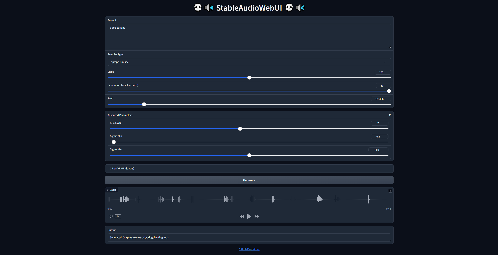

# 💀🔊 StableAudioWebUI 💀🔊

### A Lightweight Gradio Web interface for running Stable Audio Open 1.0 
 
 

 
 

# ⚠ Disclaimer

## I am not responsible for any content generated using this repository. By using this repository, you acknowledge that you are bound by the Stability AI license agreement and will only use this model for research or personal purposes. No commercial usage is allowed!  

# 🚀Updates (0.3)
✅ Optimised Code for efficiency  

✅ Simplified UI  

✅ Updated UI elements to include Advanced Parametres dropdown  

*( CFG Scale, Sigma_min, Sigma_max )*  

✅ Added Use Half precision checkbox for Low VRAM inference  

*( Float 16 )*

✅ Added choice for all Sampler types  

*( dpmpp-3m-sde, dpmpp-2m-sde, k-heun, k-lms, k-dpmpp-2s-ancestral, k-dpm-2, k-dpm-fast )*  

✅ Added link to the Repo  

[08/06/2024]

---

### Recommended Settings
Prompt: Any  
Sampler: dpmpp-3m-sde  
CFG: 7  
Sigma_Min: 0.3  
Sigma_Max: 500  
Duration: Max 47s  
Seed: Any  

### Saves Files in the following directory Output/YYYY-MM-DD/  
### using the following schema 'prompt.mp3'  

---

 ## Start by cloning the repo:
 
    git clone https://github.com/Saganaki22/StableAudioWebUI.git

    
## Use the below deployment (tested on 24GB Nvidia VRAM):

    cd StableAudioWebUI
    python -m venv myenv python=3.10
    myenv\Scripts\activate
    pip3 install torch torchvision torchaudio --index-url https://download.pytorch.org/whl/cu121
    pip install -r requirements.txt

    
## (Note if you have an older Nvidia GPU you may need to use CUDA 11.8)

    pip3 install torch torchvision torchaudio --index-url https://download.pytorch.org/whl/cu118

 If you haven't got a hugging face account or have not used huggingface-cli before, create an account and then authenticate your Hugging face account with a token (create token at https://huggingface.co/settings/tokens)

    huggingface-cli login

  (paste your token and follow the instructions, token will not be displayed when pasted)

  ## If you want to run it using CPU   
  skip 'pip install torch torchvision --index-url https://download.pytorch.org/whl/cu121' and just run

    pip install -r requirements.txt
    pip install -r requirements1.txt

## Run

    python gradio_app.py
    
 

## Bonus
If you are using Windows and followed my setup instructions you could create a batch script to activate the enviroment and run the script all in one, what you need to do is:  
 
Create a new text file in the same folder as gradio_app.py & paste this in the text file

    @echo off
    title StableAudioWebUI
    call myenv\Scripts\activate
    python gradio_app.py
    pause

then save the file as run.bat

# Screenshots (previous release)

(All with random seeds)  

Prompt: a dog barking  
CFG: 7  
Sigma_Min: 0.3  
Sigma_Max: 500  

#
 
Prompt: people clapping  
CFG: 7  
Sigma_Min: 0.3  
Sigma_Max: 500  

#
 
Prompt: didgeridoo  
CFG: 7  
Sigma_Min: 0.3  
Sigma_Max: 500  

---

## Model Details

- **Model type**: `Stable Audio Open 1.0` is a latent diffusion model based on a transformer architecture.
- **Language(s)**: English
- **License**: See the [LICENSE file](https://huggingface.co/stabilityai/stable-audio-open-1.0/blob/main/LICENSE).
- **Commercial License**: to use this model commercially, please refer to [https://stability.ai/membership](https://stability.ai/membership)

#

### [Huggingface](https://huggingface.co/stabilityai/stable-audio-open-1.0)   |   [Stable Audio Tools](https://github.com/Stability-AI/stable-audio-tools)   |   [Stability AI](https://stability.ai/news/introducing-stable-audio-open)

---

