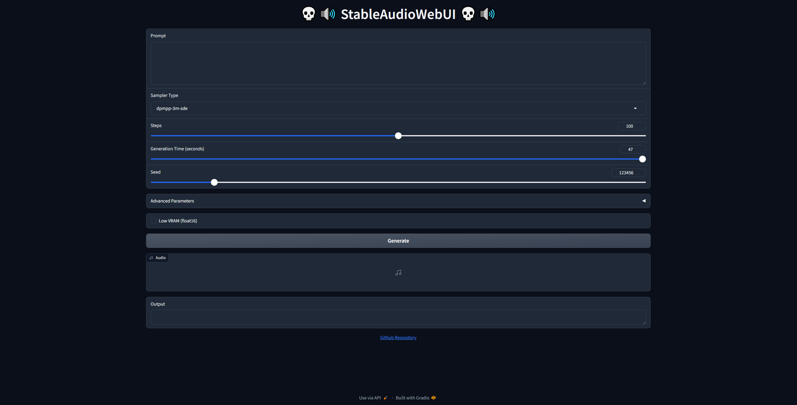

# 💀🔊 StableAudioWebUI 💀🔊

### A Lightweight Gradio Web interface for running Stable Audio Open 1.0

 
 

 
 

---

# ⚠ Disclaimer ⚠

### I am not responsible for any content generated using this repository. By using this repository, you acknowledge that you are bound by the [Stability AI license agreement](https://huggingface.co/stabilityai/stable-audio-open-1.0/blob/main/LICENSE) and will only use this model for research or personal purposes. No commercial usage is allowed!  

---
 
### Recommended Settings
Prompt: Any  
Sampler: dpmpp-3m-sde  
CFG: 7  
Sigma_Min: 0.3  
Sigma_Max: 500  
Duration: Max 47s  
Seed: Any  

### > Saves Files in the following directory Output/YYYY-MM-DD/  
### > using the following schema 'your_prompt.mp3'  

# 🚀Updates (0.3)
✅ Added [One-Click-Installer.bat](https://github.com/Saganaki22/StableAudioWebUI/releases/tag/latest) for Windows NVIDIA / CPU Builds

✅ Optimised Code for efficiency  

✅ Simplified UI  

✅ Updated UI elements to include Advanced Parametres dropdown  

*( CFG Scale, Sigma_min, Sigma_max )*  

✅ Added Use Half precision checkbox for Low VRAM inference  

*( Float 16 )*

✅ Added choice for all Sampler types  

*( dpmpp-3m-sde, dpmpp-2m-sde, k-heun, k-lms, k-dpmpp-2s-ancestral, k-dpm-2, k-dpm-fast )*  

✅ Added link to the Repo  

[08/06/2024]

---
 ### 📝 Note: For Windows builds with [Nvidia](https://github.com/Saganaki22/StableAudioWebUI/releases/download/latest/One-Click-Installer-GPU.bat) 30xx + or Float32 Capable [CPU](https://github.com/Saganaki22/StableAudioWebUI/releases/download/latest/One-Click-Installer-CPU.bat) you can use the [One-Click-Installer.bat](https://github.com/Saganaki22/StableAudioWebUI/releases/tag/latest) to simplify the process, granted you have logged in to huggingface-cli and auth'd your token prior to running the batch script: Step 3 (the huggingface-cli is used for obtaining the model file)

 ## Step 1: Start by cloning the repo:
 
    git clone https://github.com/Saganaki22/StableAudioWebUI.git

    
## Step 2: Use the below deployment (tested on 24GB Nvidia VRAM but should work with 12GB too as we have added the Load Half precision, Float16 option in the WebUI):

    cd StableAudioWebUI
    python -m venv myenv
    myenv\Scripts\activate
    pip3 install torch torchvision torchaudio --index-url https://download.pytorch.org/whl/cu121
    pip install -r requirements.txt

    
## (Note if you have an older Nvidia GPU you may need to use CUDA 11.8)

    pip3 install torch torchvision torchaudio --index-url https://download.pytorch.org/whl/cu118

Step 3: (Optional - read more): If you haven't got a hugging face account or have not used huggingface-cli before, create an account and then authenticate your Hugging face account with a token (create token at https://huggingface.co/settings/tokens)

    huggingface-cli login

  (paste your token and follow the instructions, token will not be displayed when pasted)

  ## If you want to run it using CPU   
  omit 'pip install torch torchvision --index-url https://download.pytorch.org/whl/cu121' and the process after it and just run

    pip install -r requirements1.txt
    pip install -r requirements.txt

## Step 4: Run

    python gradio_app.py
    
 

## ⭐ Bonus
If you are using Windows and followed my setup instructions you could create a batch script to activate the enviroment and run the script all in one, what you need to do is:  
 
Create a new text file in the same folder as gradio_app.py & paste this in the text file

    @echo off
    title StableAudioWebUI
    call myenv\Scripts\activate
    python gradio_app.py
    pause

then save the file as run.bat
 
# Screenshots (older build)

(All with random seeds)  

Prompt: a dog barking  
CFG: 7  
Sigma_Min: 0.3  
Sigma_Max: 500  

  

https://github.com/Saganaki22/StableAudioWebUI/assets/84208527/4ca9eb1b-2808-4f39-b7e3-f35c736eb7b7

#
 
Prompt: people clapping  
CFG: 7  
Sigma_Min: 0.3  
Sigma_Max: 500  

  

https://github.com/Saganaki22/StableAudioWebUI/assets/84208527/1f333384-d4e6-4167-abec-5167e2f4822f

#
 
Prompt: didgeridoo  
CFG: 7  
Sigma_Min: 0.3  
Sigma_Max: 500  

  

https://github.com/Saganaki22/StableAudioWebUI/assets/84208527/1cb7ce3b-7463-46a8-ba9a-3a5aa232d43a

---

## Model Details

- **Model type**: `Stable Audio Open 1.0` is a latent diffusion model based on a transformer architecture.
- **Language(s)**: English
- **License**: See the [LICENSE file](https://huggingface.co/stabilityai/stable-audio-open-1.0/blob/main/LICENSE).
- **Commercial License**: to use this model commercially, please refer to [https://stability.ai/membership](https://stability.ai/membership)

#

### [Huggingface](https://huggingface.co/stabilityai/stable-audio-open-1.0)   |   [Stable Audio Tools](https://github.com/Stability-AI/stable-audio-tools)   |   [Stability AI](https://stability.ai/news/introducing-stable-audio-open)

---

